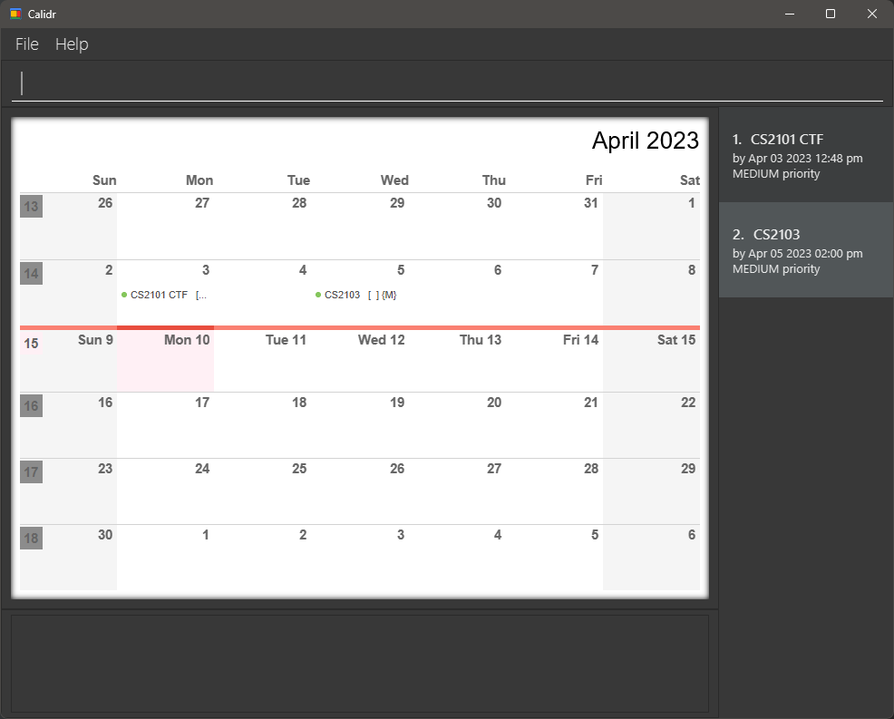
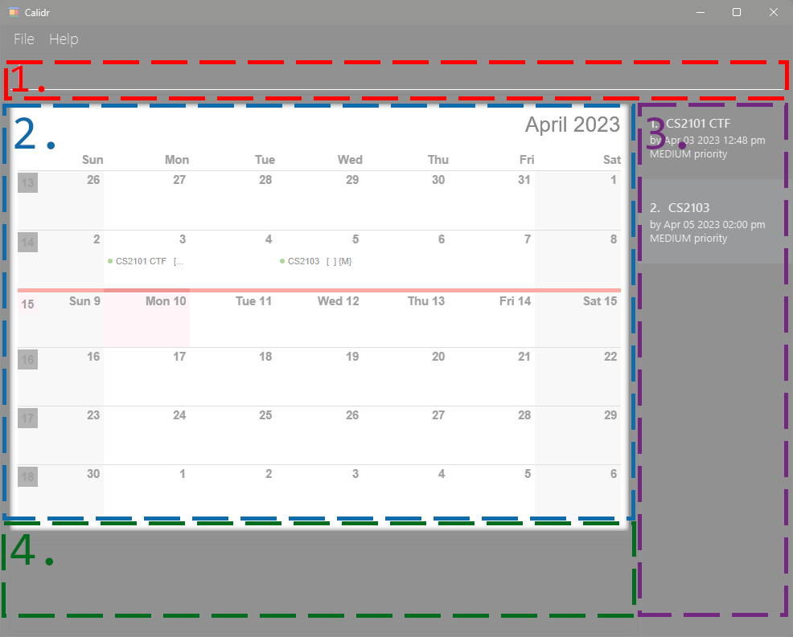
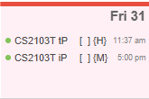
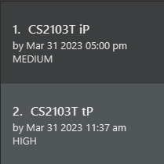
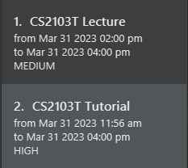

# Calidr: User Guide

Welcome!

Calidr is a **time-management and scheduling calendar application** for university students, optimized for use via a Command Line Interface (CLI) while still having the benefits of a Graphical User Interface (GUI). Calidr helps you manage and store your classes, assignments, deadlines, and tasks from one place.
          
This guide provides detailed instructions on how to use the features of Calidr. Whether you're a new user [getting started](#quick-start) with the basics or an experienced user looking for [advanced tips and tricks](#paperclip-features), this guide has everything you need to know.

We recommend that you refer to the [Definitions](#mag-definitions) to familiarize yourself with the terminology used in this guide.

If you have any questions or run into problems, check out the [FAQ](#faq) for solutions to commonly faced issues.

* Table of Contents
{:toc}

--------------------------------------------------------------------------------------------------------------------

## Quick start

1. Ensure you have Java `11` or above installed in your Computer.

2. Download the latest `calidr.jar`, available [here](https://github.com/AY2223S2-CS2103T-W10-2/tp/releases).

3. Copy the file to the folder you want to use as the _home directory_ for your Calidr.

4. Double-click the `calidr.jar` file.
   A window similar to the one shown below will appear.
   

5. Type the command in the command box at the top and press `Enter` to execute it.

   E.g. typing **`help`** and pressing Enter will open the help window. 

6. Refer to the [Features](#paperclip-features) below for details of each command.

--------------------------------------------------------------------------------------------------------------------

## :mag: Definitions

### Command definitions

🕮 From now on we'll be using a slightly modifided version of the <a href="http://docopt.org/">docopt</a> command description language.

          
Test

1. We will use the word "**string**" to describe any general sequence of characters.
2. We will use the word "**word**" to describe a sequence of characters terminated by a whitespace.
3. Words ending with a backslash `/` are interpreted as _compulsory_, _position-independent_ **options**.

   `t/`,`by/`,`from/`,`to/`
4. Uppercase words denote the position of **arguments**.
5. All other words that do not follow the above conventions are interpreted as **commands** and **subcommands**.

   `help`
6. Options can have arguments specified after a whitespace. Together they are refered to as a **field**.

   `todo t/ <title> by/ <date-time>`
7. An option's arguments, when bracketed by "<" and ">", can be **whitespace-containing** strings. They are terminated
   by a newline or a different option, matching *leftmost-first*

   `event t/ <title> from/ <start-date-time> to/ <end-date-time>`
8. Else, if the arguments are in uppercase, they must be **strictly words** terminated by whitespace

   `delete TASK_INDEX`
9. Some commands may accept a single *positional* argument string, known as a **main argument**, beginning after a
   whitespace following the command itself and terminating at a newline or the first option, matching *leftmost-first*.

   `edit TASK_INDEX t/ <title>`
10. Options (and arguments) bracketed with "\[" and  "\]" are **optional**.

    `[d/ <description>] [p/ <priority>]`
11. Ellipsis "..." specify that the argument (or field) to the left could be **repeated** multiple times:

    `[tag/ <tag>]...`
12. *All elements are required by default*, if not included in brackets "\[ \]". However, sometimes it is necessary to
    mark elements as **required** explicitly with parentheses "( )". For example, when you need to group
    mutually-inclusive elements (if *one* element is present, then *another* one is required):

    `edit TASK_INDEX (OPTION <argument>)...`

### Data terminology

1. Elements on a calendar are referred to as **Tasks**.
2. Tasks must have a **title**.
3. A task can have an optional **description**, **location**, and multiple **tags(s)**.
4. Tasks have an associated **priority**.
    1. Priority is one of `HIGH`, `MEDIUM` or `LOW`.
    3. Tasks have a default priority of `MEDIUM`.
5. Tasks must either be **ToDos** or **Events**.
    1. ToDos have a single associated **date-time** (e.g. a due date).
        1. ToDos also have an associated **status**.
            1. Status is one of `DONE` or `NOT DONE`.
            1. ToDos have a default status of `NOT DONE`.
    2. Events have *two* associated date-times (e.g a start and end-date).
6. Dates are specified in the format `DD-MM-YYYY`. Date-times are specified in the format `DD-MM-YYYY HHMM`. Calidr also
   accepts and automatically parser the following keywords as date-times:

   `today`, `tomorrow`, `next week`, `next month`, `next year`
7. Tasks are uniquely identified by their **task index**. This is given in the list panel, and is also used to refer to
   tasks in commands.

### UI terminology

1. **Command box**
   
   The command box is where you can type in commands to Calidr. Pressing `Enter` will execute the
   command.

1. **Calendar panel**
   
   The calendar panel is where you can view your tasks graphically. Tasks are displayed as coloured
blocks, with green being **ToDos** and blue being **Events**. The calendar panel also displays the _focused_ date and
time, which [may not be the current time](#viewing-a-different-date-view).

1. **List panel**
   
   The list panel is where Calidr will display the list of tasks that match your command. This usually
just shows all the tasks in the calendar, but can
be [filtered by title, date, or other criteria](#searching-and-filtering-for-tasks-search).

1. **Result panel**
   
   The result panel is where Calidr will display the result of your command, including any errors.

## :paperclip: Features

#### View help: `help`

Shows a message explaining how to access this help page.

#### Adding tasks

- #### Adding a ToDo: `todo`
  Adds a new ToDo with the given title, date-time, description, location and tags to the list of tasks.

  Format: `todo t/ <title> by/ <date-time> [d/ <description>] [l/ <location>] [p/ <priority>] [tag/ <tag>]...`

  Examples:
    - `todo t/ CS2103T iP by/ 31-03-2023 1700`

      Adds a new ToDo with the title `CS2103T iP` due on the 31st of March 2023 at 5pm.
    - `todo t/ CS2103T tP by/ today d/ Complete the tP l/ Online p/ HIGH tag/ CS2103T tag/ tP`
  
      Adds a new ToDo with the title `CS2103T tP`, due today, with description `Complete the tP`, location `Online`, a high priority, and tags `CS2103T` and `tP`.
  
  You should see the following in the calendar and results panel respectively:

  | Calendar panel                  | Results Panel                |
  |---------------------------------|------------------------------|
  |  |  |
    
  

- #### Adding an Event: `event`
  Adds a new event with the given title, starting date-time, ending date-time, description, location and tags to the
  list of tasks.

  Format: `event t/ <title> from/ <start-date-time> to/ <end-date-time> [d/ <description>] [l/ <location>] [p/ <priority>] [tag/ <tag>]...`

  Examples:
    - `event t/ CS2103T Lecture from/ 31-03-2023 1400 to/ 31-03-2023 1600`

      Adds a new event with the title `CS2103T Lecture` starting on the 31st of March 2023 at 2pm and ending at 4pm.
    - `event t/ CS2103T Tutorial from/ today to/ 31-03-2023 1600 d/ Lecture on UML l/ Online p/ HIGH tag/ CS2103T tag/ Tutorial`

      Adds a new event with the title `CS2103T Tutorial`, starting today and ending on the 31st of March 2023 at 4pm, with description `Lecture on UML`, location `Online`, a high priority, and tags `CS2103T` and `Tutorial`.

  You should see the following in the calendar and results panel respectively:

  | Calendar panel                  | Results Panel                |
  |---------------------------------|------------------------------|
  |  |  |

#### Editing tasks: `edit`

Edits information about a particular task specified by its index. Edits the title, date-times (*by, from, to*), description, location and tags of the referenced task.

🕮 When modifying an event, fields unique to todo will be parsed as strings, and vice versa.

Format: `edit TASK_INDEX [t/ <title>] [by/ <date-time>] [from/ <date-time>] [to/ <date-time>] [d/ <description>] [l/ <location>] [p/ <priority>] [tag/ <tag>]...`

Examples:
- `edit 4 from/ 05-03-2023 2000 to/ 06-03-2023 2000 l/ NUS`
- `edit 2 t/ Essay by/ 04-04-2023 2359 tag/ ES2660`

#### Updating task status

- #### Marking as *done*: `mark`
  Marks the task specified by its index as *done*.

  Format: `mark TASK_INDEX`

  Example: `mark 3`

- #### Marking as *not done*: `unmark`
  Marks the task specified by its index as *not done*.

  Format: `unmark TASK_INDEX`

  Example: `unmark 1`

#### Searching and filtering for tasks: `search`

Searches for tasks with matching keywords in their fields. Filtered tasks are displayed in a list to the side.

🕮 
<ul>
<li>Keyword matching is case-insensitive</li>
    <li>All tasks whose titles have any of the given keywords will be displayed in the list.</li>
    <li>The entire keyword must be contained in the title of the task for the task to be displayed.</li>
</ul>    

Format: `search KEYWORD [MORE KEYWORDS]...`

Examples:
- `search book`
- `search assignment homework`

<!--- TODO -->

#### Deleting a task: `delete`

Deletes one or more tasks from the calendar.

Format: `delete TASK_INDEX`

Example: `delete 2`

#### Editing task details: `edit`

Edits information pertaining to a particular task given by the index.

Format: `edit TASK_INDEX (OPTION <argument>)...`

Example: for a task which is an event of index 4,
`edit 4 from/ 05-03-2023 2000 to/ 06-03-2023 2000`

#### Switching to a different layout: `page`

By default, the calendar panel is displayed in a monthly-layout. A weekly or daily-layout is supported if you wish to
view more or less tasks.

Format: `page LAYOUT`, where `LAYOUT` is one of `month`, `week`, or `day`.

Example: `page week`

#### Viewing a different date: `view`

By default, the calendar panel is focused on the current date. When you wish to view a different month, week or day, you
can use the `view` command.

Format: `view <date-time>`.

Example:

- `view 01-03-2023`
- `view next week`

#### Showing all the details of a task: `show`

The GUI displays a condensed representation of tasks in both the calendar and list panels. This commmand shows all the
details of a particular task, including its description, location and tags, in a pop-up dialog.

Format: `show TASK_INDEX`

Example: `show 2`

## Command summary

| Action          | Format, Examples                                                                                                                                                                                                                                                     |
|-----------------|----------------------------------------------------------------------------------------------------------------------------------------------------------------------------------------------------------------------------------------------------------------------|
| **Add Todo**    | `todo t/ <title> by/ <date-time> [d/ <description>] [l/ <location>] [p/ <priority>] [tag/ <tag>]...`   e.g., `event t/ CS2103T Lecture from/ today to/ 31-03-2023 1600 d/ Lecture on UML l/ Online p/ HIGH tag/ CS2103T tag/ Lecture`                             |
| **Add Event**   | `event t/ <title> from/ <start-date-time> to/ <end-date-time> [d/ <description>] [l/ <location>] [p/ <priority>] [tag/ <tag>]...`   e.g. `event t/ CS2103T Lecture from/ today to/ 31-03-2023 1600 d/ Lecture on UML l/ Online p/ HIGH tag/ CS2103T tag/ Lecture` |
| **Edit**        | `edit TASK_INDEX [t/ <title>] [by/ <date-time>] [from/ <date-time>] [to/ <date-time>] [d/ <description>] [l/ <location>] [p/ <priority>] [tag/ <tag>]...`   e.g. `edit 2 t/ Essay by/ 04-04-2023 2359 d/700 words p/ high tag/ ES2660`                            |
| **Mark**        | `mark TASK_INDEX`  e.g., `mark 3`                                                                                                                                                                                                                                 |
| **Unmark**      | `unmark TASK_INDEX`  e.g., `unmark 1`                                                                                                                                                                                                                             |                                                                                                                                                                                                      
| **Delete**      | `delete TASK_INDEX`  e.g., `delete 2`                                                                                                                                                                                                                             |                                                                                                                                                             |
| **Help**        | `help`                                                                                                                                                                                                                                                               |
| **Switch Page** | `page LAYOUT`  e.g., `page day`                                                                                                                                                                                                                                   |
| **View Date**   | `view <date-time>`  e.g., `view next week`                                                                                                                                                                                                                        |
| **Show Task**   | `show TASK_INDEX`  e.g., `show 1`                                                                                                                                                                                                                                 |

### Other

#### Saving your data

Calidr user preferences and calendar information is saved in the hard disk automatically after any modification command. The calendar data is stored
as an [ics file](https://www.ical4j.org/).

#### Editing the data file

The `calendar.ics` save file is located in the `data` folder the directory the program resides in (i.e. `[root_directory]/data/calendar.ics`). Advanced
users are welcome to manipulate data directly by editing the save file.

:exclamation: **Caution:**
    If your changes to the save file makes its format invalid, Calidr will discard all data and start with an empty data file the next time it's run.

--------------------------------------------------------------------------------------------------------------------

## FAQ

**Q**: How do I transfer my data to another computer? 
**A**: Install the app in the other computer and overwrite the empty data file it creates with the file that contains
the data of your previous Calidr home directory.

--------------------------------------------------------------------------------------------------------------------

